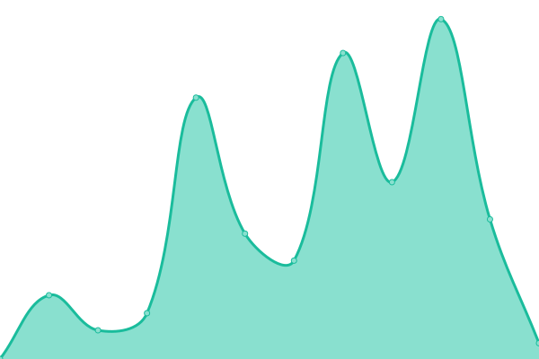

# [📈 Live Status](https://status.muesliswap.com): <!--live status--> **🟩 All systems operational**

This repository contains the open-source uptime monitor and status page for [BCHMuesliSwap](bch.muesliswap.com), powered by [Upptime](https://github.com/upptime/upptime).

With [Upptime](https://upptime.js.org), you can get your own unlimited and free uptime monitor and status page, powered entirely by a GitHub repository. We use [Issues](https://github.com/muesliswap/uptime-monitor/issues) as incident reports, [Actions](https://github.com/muesliswap/uptime-monitor/actions) as uptime monitors, and [Pages](https://status.muesliswap.com) for the status page.

<!--start: status pages-->
<!-- This summary is generated by Upptime (https://github.com/upptime/upptime) -->
<!-- Do not edit this manually, your changes will be overwritten -->
<!-- prettier-ignore -->
| URL | Status | History | Response Time | Uptime |
| --- | ------ | ------- | ------------- | ------ |
|  [Main Website](https://www.muesliswap.com/health.html) | 🟩 Up | [main-website.yml](https://github.com/MuesliSwapLabs/uptime-monitor/commits/HEAD/history/main-website.yml) | 

 473ms
     
 | 

<a href="https://status.muesliswap.com/history/main-website">100.00%</a>
    

|  [API Backend](https://api.muesliswap.com/health) | 🟩 Up | [api-backend.yml](https://github.com/MuesliSwapLabs/uptime-monitor/commits/HEAD/history/api-backend.yml) | 

 726ms
     
 | 

<a href="https://status.muesliswap.com/history/api-backend">100.00%</a>
    

|  [Staking Backend](https://staking.muesliswap.com/health) | 🟩 Up | [staking-backend.yml](https://github.com/MuesliSwapLabs/uptime-monitor/commits/HEAD/history/staking-backend.yml) | 

 651ms
     
 | 

<a href="https://status.muesliswap.com/history/staking-backend">100.00%</a>
    

|  [Tokens Backend](https://tokens.muesliswap.com/health) | 🟩 Up | [tokens-backend.yml](https://github.com/MuesliSwapLabs/uptime-monitor/commits/HEAD/history/tokens-backend.yml) | 

 706ms
     
 | 

<a href="https://status.muesliswap.com/history/tokens-backend">100.00%</a>
    

|  [Onchain Backend](https://onchain.muesliswap.com/health) | 🟩 Up | [onchain-backend.yml](https://github.com/MuesliSwapLabs/uptime-monitor/commits/HEAD/history/onchain-backend.yml) | 

 3718ms
     
 | 

<a href="https://status.muesliswap.com/history/onchain-backend">100.00%</a>
    

<!--end: status pages-->

[**Visit our status website →**](https://status.muesliswap.com)

## 📄 License

- Powered by: [Upptime](https://github.com/upptime/upptime)
- Code: [MIT](./LICENSE) © [BCHMuesliSwap](bch.muesliswap.com)
- Data in the `./history` directory: [Open Database License](https://opendatacommons.org/licenses/odbl/1-0/)
